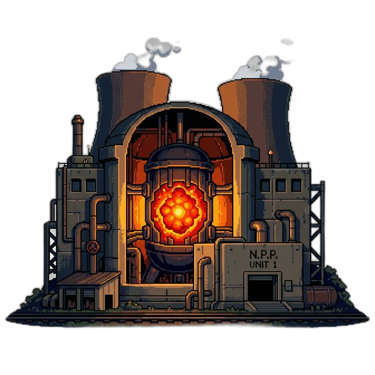

<p align="center">
  
</p>

<h1 align="center">📺 CIVIC NIGHTMARE</h1>

<p align="center">
  <strong>The Bureaucracy RPG</strong><br>
  A surreal 16-bit political satire about the most dangerous quest of all: renewing a passport.
</p>

<p align="center">
  <a href="https://daniele-cangi.github.io/civic-nightmare/"></a>
  <a href="https://unityloop.itch.io/civic-nightmare"></a>
  <a href="CONTRIBUTING.md"></a>
</p>

<p align="center">
  
  
  
  
  
  
  
</p>

<p align="center">
  
  
  
  <a href="https://github.com/Daniele-Cangi/civic-nightmare/actions/workflows/deploy.yml"></a>
</p>

**Civic Nightmare** is a satirical, top-down RPG built in **Godot 4.6** that explores the absurdity of modern global governance, corporate dominance, and the digital age. You play as a scrawny, debt-burdened citizen on a desperate quest to renew a passport, navigating a world where reality is filtered through 16-bit aesthetics and 90s television glitches.

## 🕹️ Game Features

### 🏛️ The Great Signature Quest
Navigate a procedurally detailed overworld and interact with the "Architects of the Spectacle"—now part of a high-fidelity **Global Tournament** roster. To get your document signed, you must confront:

- **Donald Trump**: Within his Golden Eagle monument, featuring a high-fidelity "Fighter Card" combat portrait.
- **Elon Musk**: Inside a minimalist SpaceShip HQ, portrayed as an "M. Bison" style corporate overlord.
- **Ursula von der Leyen**: Guarding the Labyrinth of Regulations with the "Hammer of Directives."
- **Vladimir Putin**: Within a cross-shaped bunker, active on the "Red Phone" network.
- **Christine Lagarde**: Managed by interest rates, appearing in a custom "Chun-Li" arcade style.
- **Emmanuel Macron**: Offering Raiden-style philosophy lectures near the Eiffel Tower ruins.

### 🛸 Optional Investigations, Deviations & Anomalies
- **Historical Contamination**: A pathetic, spectral "Hitler" parody who haunts the map, opening his military overcoat (Superman style) to reveal "ZZ" branding.
- **The Southern Sanctuary**: Find **Sam Altman** searching for trillion-dollar funding near an unstable Nuclear Plant (and its Neural Core).
- **Intercepted Channels**: Meet **Xi Jinping** at the Great Wall, or overhear **Kim Jong-un** using the Red Phone to negotiate grocery deliveries with **Russia**, **Iran (Mojtaba)**, and **Sweden**.
- **The Quantum UFO**: Get abducted into an observation deck where **Albert Einstein** and a crying 80s-anime **Mark Zuckerberg** debate the monetization of the universe—and where the case clock stops making sense.
- **The Hidden Bunker**: Ignore a direct protocol warning and find **Zelensky** making a final plea while **Death** waits to void the paperwork.
- **The Drone Escalation**: Follow an unsolicited delivery system into the Fulfillment Cathedral, contest a cybernetic Bezos with paperwork and objections, then discover whether a physical victory is contractually recognizable.

### 🤖 C.L.A.U.D.I.A. Assistant
Your central hub is a satirical 90s digital mascot—a parody of modern AI assistants—housed in a CRT terminal. She provides helpful (and highly cynical) guidance on your path to bureaucratic salvation.

### 💾 Persistent Dossier
The title screen offers **Continue** and **New Game**. Progress, encounter consequences, and final-mission state are archived in a versioned local dossier; Continue always returns the player to the latest safe overworld checkpoint instead of reopening a cutscene or room transition midway through it. ESC places the case under a diegetic **Administrative Hold** whose available material changes as the procedure develops.

Web persistence uses the browser's IndexedDB-backed `user://` storage and therefore requires site storage to be allowed; private browsing may not retain the dossier. See the [Godot Web export limitations](https://docs.godotengine.org/en/stable/tutorials/export/exporting_for_web.html#using-cookies-for-data-persistence).

<table>
  <tr>
    <td width="33%" align="center"></td>
    <td width="33%" align="center"></td>
    <td width="33%" align="center"></td>
  </tr>
  <tr>
    <td align="center"><strong>THE GOLDEN EAGLE</strong><br><sub>Patriotism, now with collision.</sub></td>
    <td align="center"><strong>QUANTUM UFO</strong><br><sub>Intergalactic monetization awaits.</sub></td>
    <td align="center"><strong>NEURAL CORE</strong><br><sub>Perfectly safe. Legally speaking.</sub></td>
  </tr>
</table>

## 🎨 Technical & Aesthetic Identity

- **16-bit Arcade Style**: Every character features a dual-asset system: a low-detail world sprite and a high-fidelity 16-bit "Fighter Card" for dialogue and combat.
- **Portrait Pipeline**: Fighter portraits use controlled chroma-key extraction, premultiplied-alpha resizing, and automated 128×128 validation for clean, halo-free transparency.
- **Authority Architecture**: The six signature encounters use dedicated 352 px hero facades with shared perspective, pixel density, lighting, and door alignment instead of procedural roof symbols. Their reusable visual contract is documented in the [facade art direction](docs/AUTHORITY_FACADE_ART_DIRECTION.md).
- **Narrative Interiors**: Authority rooms may replace the shared visual tile pass with a full authored environment while keeping the same travel, collision, dialogue, and save contract. All six signature authorities now reveal a different machine beneath their public architecture; the reusable visual grammar is documented in the [interior art direction](docs/AUTHORITY_INTERIOR_ART_DIRECTION.md).
- **Optional Investigations**: Xi, Kim, and Altman use the same authored-room contract to turn surveillance, the Red Phone, and the nuclear AI demonstration into environmental consequences rather than generic bonus rooms.
- **Southern Administrative Annex**: A dedicated optional exterior makes Kim's televised strategic spectacle and Altman's immaculate AI demo visibly depend on the same failing municipal utility layer. The [area art direction](docs/SOUTHERN_ANNEX_ART_DIRECTION.md) records its gate, layout and travel contract.
- **Classified and Anomalous Interiors**: The bunker now visualizes war as prohibited administrative routine, while the UFO gives the evidence system a room whose clocks, objects, shadows, and geometry cannot agree.
- **VHS/CRT Effects**: Custom shaders provide a nostalgic 80s/90s television feel, complete with scanlines, chromatic aberration, and "Breaking News" ticker bars.
- **Authored District Ground**: A continuous 2176×2048 pixel-art plate gives all six authority compounds a distinct material identity without visible tile seams. Path reservations, collisions, forests, encounters, and entrances remain procedural gameplay layers above it. The contract and generation prompt are documented in the [district art direction](docs/WORLD_DISTRICT_ART_DIRECTION.md).

## 🤝 Contributing

**The bureaucracy is accepting applications.** Contributions are welcome—from bug fixes and dialogue to encounters, pixel art, rooms, accessibility, translations, tests, tooling, and carefully scoped architectural improvements.

Start with [`CONTRIBUTING.md`](CONTRIBUTING.md), then use the [`architecture guide`](docs/ARCHITECTURE.md) to find the right system. The source-code license is in [`LICENSE`](LICENSE); media and narrative rights are explained separately in [`ASSET_NOTICE.md`](ASSET_NOTICE.md).

## 🚀 Play & Run Locally

1. **Prerequisites**: Godot Engine 4.6 (Standard).
2. **Setup**:
   - Clone the repository.
   - Open `project.godot` in the engine.
   - Run the `main.tscn` scene.
3. **Web Support**: Optimized for GLES3, with a custom CI/CD pipeline for GitHub Pages deployment.

Or [play the current build directly in your browser](https://daniele-cangi.github.io/civic-nightmare/).

## 🧩 Project Structure

`scripts/main.gd` is the composition root: it builds the overworld and coordinates the game-specific story transitions. Reusable state and UI behavior live in focused modules:

- `scripts/managers/`: dialogue, quest progression, behavioural evidence, versioned save data, room transitions, environment setup, and static world landmarks.
- `scripts/data/`: read-only character colors, portraits, world sprites, and authority-facade metadata.
- `assets/landmarks/`: runtime-sized exterior hero facades for the six required-signature locations.
- `assets/interiors/`: opaque authored room backgrounds aligned to the shared indoor gameplay canvas.
- `assets/backgrounds/`: collision-neutral overworld ground art rendered beneath the procedural gameplay layers.
- `scripts/sequences/`: title, intro, MK, and ending presentation timelines.
- `scripts/encounters/`: self-contained Xi, Kim, UFO, Bezos-drone, and Bezos-cinematic logic.
- `data/characters.json`: character dialogue, choices, and presentation metadata.
- `scenes/interiors/`: reusable interior scenes and room-local behavior.
- `scenes/areas/`: authored exterior travel containers that reuse the room transition contract without indoor presentation.

See [`docs/ARCHITECTURE.md`](docs/ARCHITECTURE.md) for ownership boundaries, runtime flow, and contributor guidance.

## ✅ Verification

From the repository root, run:

```bash
godot --headless --path . --editor --quit
godot --headless --path . --log-file .godot/flow-smoke.log --script res://tests/smoke_test.gd
```

The smoke test loads the main scene and covers the title flow, dossier interpretation and save/restore round trips, Administrative Hold, AI dialogue, and an interior round trip.

## ⚖️ License

**Source code and software implementation:** [MIT](LICENSE).

**Media and narrative content:** not automatically covered by the MIT code license; see [`ASSET_NOTICE.md`](ASSET_NOTICE.md) for the repository's rights boundary and contribution policy.

---

*"Your passport will arrive in 4-6 business years. Thank you for your patience."*
