<p align="center">
  
</p>

<h1 align="center">📺 CIVIC NIGHTMARE</h1>

<p align="center">
  <strong>The Bureaucracy RPG</strong><br>
  A surreal political satire about the most dangerous quest of all: renewing a passport.
</p>

<p align="center">
  <a href="https://daniele-cangi.github.io/civic-nightmare/"></a>
  <a href="https://unityloop.itch.io/civic-nightmare"></a>
  <a href="CONTRIBUTING.md"></a>
</p>

<p align="center">
  
  
  
  
  
  
  
</p>

<p align="center">
  
  <a href="https://github.com/Daniele-Cangi/civic-nightmare/releases/tag/v2.0.0"></a>
  
  
  <a href="https://github.com/Daniele-Cangi/civic-nightmare/actions/workflows/deploy.yml"></a>
</p>

**Civic Nightmare** is a satirical, top-down RPG built in **Godot 4.6** that explores the absurdity of modern global governance, corporate dominance, and the digital age. You play as a scrawny, debt-burdened citizen on a desperate quest to renew a passport, crossing high-detail districts where pixel-scale citizens, monumental political caricature, arcade confrontation, and CRT bureaucracy occupy the same collapsing reality.

## 🕹️ Game Features

### 🚗 The Administrative Approach
New Game first tunes into a short, skippable CRT news bulletin: war is good for quarterly earnings, automation remains human-centered, and the passport district advises citizens to arrive in a roadworthy vehicle. The signal then cuts directly to an approximately 90-second playable sunset drive toward the district. The citizen must drive but cannot fail: officials inaugurate an unrepaired pothole, a motorcade requisitions a private gold lane, a mobile toll corrects which lane was open, and a checkpoint grants access only after its barrier collapses. All the while the battered economy car sheds parts and the presentation insists this is the greatest journey ever undertaken, now scored by the original arcade-driving track **Coastline Dash**. Only the bulletin can be skipped; the drive is mandatory gameplay.

### 🏛️ The Great Signature Quest
Navigate an authored overworld and confront six different machines of authority. To get your document signed, you must deal with:

- **Donald Trump**: Broadcast patriotism, gold-plated access, and a monument already posing for its own victory screen.
- **Elon Musk**: A permanent-beta headquarters where unfinished infrastructure is presented as inevitable progress.
- **Ursula von der Leyen**: A transparency maze whose instructions require their own instructions.
- **Vladimir Putin**: A ceremonial palace barricaded for a war that official paperwork insists is proceeding normally.
- **Christine Lagarde**: A stability vault that protects confidence more carefully than citizens.
- **Emmanuel Macron**: Managed decline staged as elegance, philosophy, and excellent lighting.

Trump, Ursula, and Lagarde now defend their doors with playable procedures. **The Greatest Deal** is readable blackjack first—visible hands, totals, `HIT`, `STAND`, and a target of 21—then asks whether Trump's post-result intervention should be accepted or challenged. **The Consensus Engine** turns 27 approvals into a physical machine of scanners, stamps, translations, moving documents, and lawful exceptions. **The 2% Miracle** makes the citizen physically stabilize an inflation indicator with euro balls, rate bumpers, liquidity injection, and a methodology that becomes more flexible than the economy. Clearing a procedure opens the existing encounter without replacing its dialogue.

### 🛸 Optional Investigations, Deviations & Anomalies
- **Historical Contamination**: A pathetic, spectral "Hitler" parody who haunts the map, opening his military overcoat (Superman style) to reveal "ZZ" branding.
- **The Southern Sanctuary**: Find **Sam Altman** searching for trillion-dollar funding near an unstable Nuclear Plant (and its Neural Core).
- **Intercepted Channels**: Meet **Xi Jinping** at the Great Wall, or overhear **Kim Jong-un** using the Red Phone to negotiate grocery deliveries with **Russia**, **Iran (Mojtaba)**, and **Sweden**.
- **The Quantum UFO**: Get abducted into an observation deck where **Albert Einstein** and a crying 80s-anime **Mark Zuckerberg** debate the monetization of the universe—and where the case clock stops making sense.
- **The Hidden Bunker**: Ignore a direct protocol warning, survive a one-minute transfer corridor where bombs arrive and funding departs, then find **Zelensky** making a final plea while **Death** waits to void the paperwork.
- **The Drone Escalation**: Follow an unsolicited delivery system into the Fulfillment Cathedral, contest a cybernetic Bezos with paperwork and objections, then discover whether a physical victory is contractually recognizable.

### 🤖 C.L.A.U.D.I.A. Assistant
Your central hub is a satirical 90s digital mascot—a parody of modern AI assistants—housed in a CRT terminal. She provides helpful (and highly cynical) guidance on your path to bureaucratic salvation.

### 💾 Persistent Dossier
The title screen offers **Continue** and **New Game**. Progress, encounter consequences, and final-mission state are archived in a versioned local dossier; Continue always returns the player to the latest safe overworld checkpoint instead of reopening a cutscene or room transition midway through it. ESC places the case under a diegetic **Administrative Hold** whose available material changes as the procedure develops.

Web persistence uses the browser's IndexedDB-backed `user://` storage and therefore requires site storage to be allowed; private browsing may not retain the dossier. See the [Godot Web export limitations](https://docs.godotengine.org/en/stable/tutorials/export/exporting_for_web.html#using-cookies-for-data-persistence).

## 🎞️ Civic Nightmare 2.0

These images are all loaded by the current game runtime—not superseded concept art.

### Actual gameplay

<table>
  <tr>
    <td width="50%">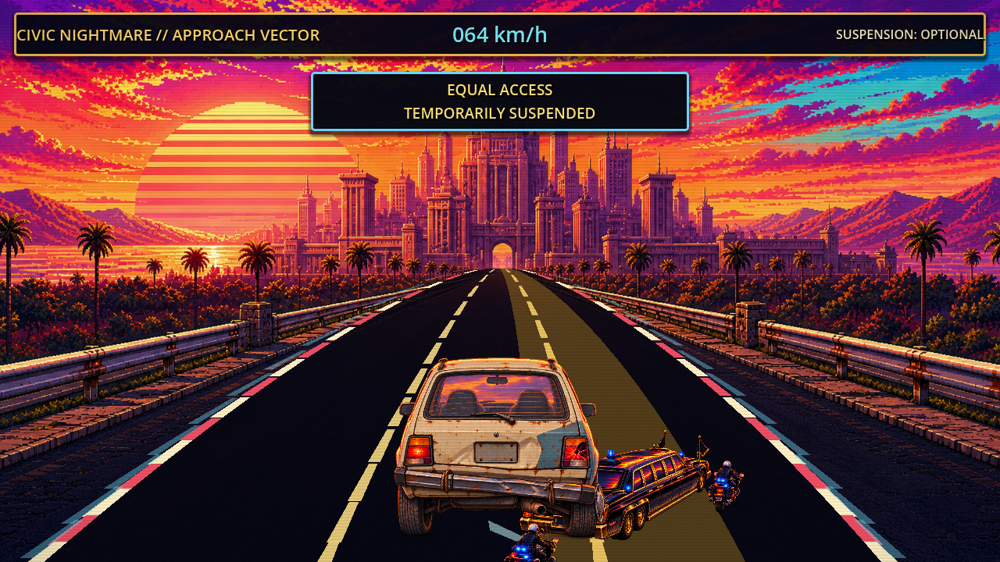</td>
    <td width="50%">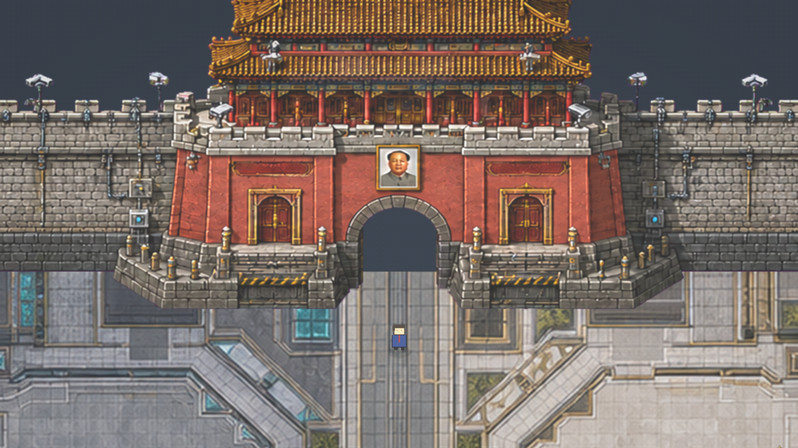</td>
  </tr>
  <tr>
    <td align="center"><strong>EQUAL ACCESS</strong><br><sub>Temporarily suspended at 64 km/h.</sub></td>
    <td align="center"><strong>HARMONIOUS ENTRY</strong><br><sub>The cameras agree that you have arrived.</sub></td>
  </tr>
  <tr>
    <td width="50%">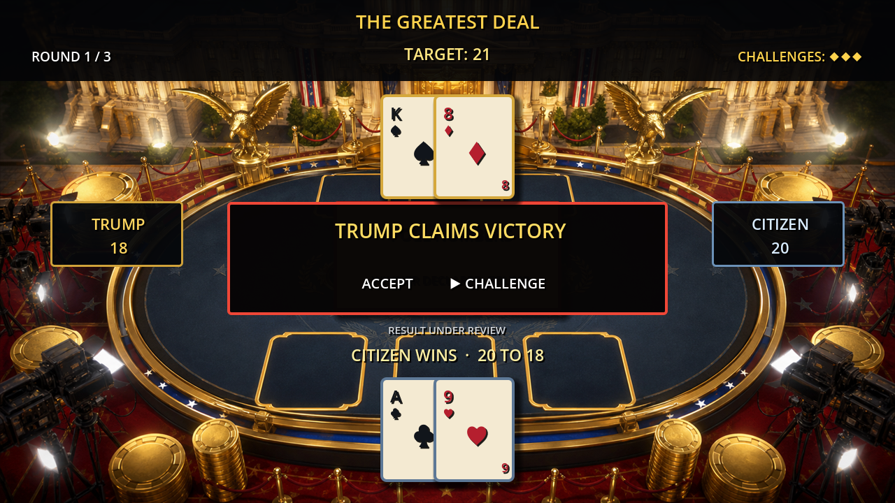</td>
    <td width="50%">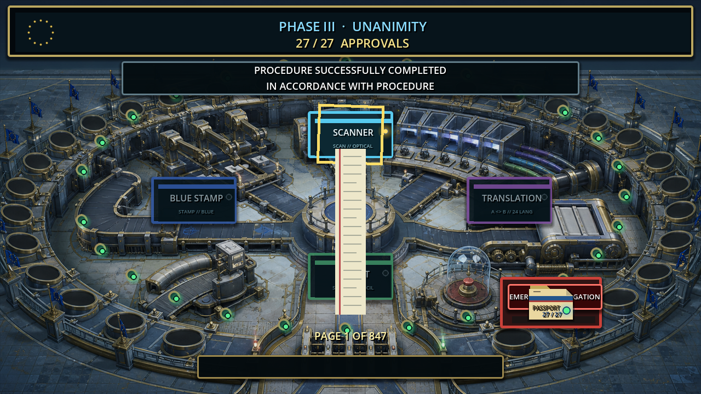</td>
  </tr>
  <tr>
    <td align="center"><strong>RESULT UNDER REVIEW</strong><br><sub>Twenty to eighteen remains open to interpretation.</sub></td>
    <td align="center"><strong>UNANIMOUS APPROVAL</strong><br><sub>Procedure successfully completed in accordance with procedure.</sub></td>
  </tr>
  <tr>
    <td colspan="2" align="center">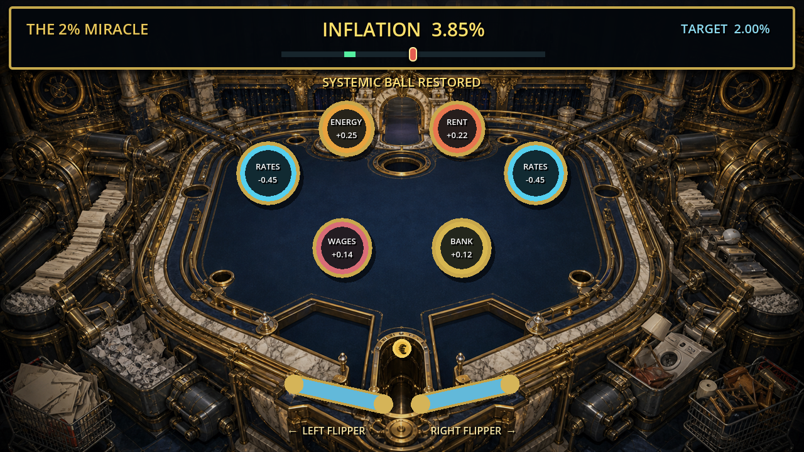</td>
  </tr>
  <tr>
    <td colspan="2" align="center"><strong>THE 2% MIRACLE</strong><br><sub>The ball is systemic. Your purchasing power is not.</sub></td>
  </tr>
</table>

The five full-resolution captures are also the approved itch.io screenshot set;
their upload order and provenance are recorded in
[`asset_sources/marketing/README.md`](asset_sources/marketing/README.md).

### Runtime art gallery

<table>
  <tr>
    <td colspan="3" align="center">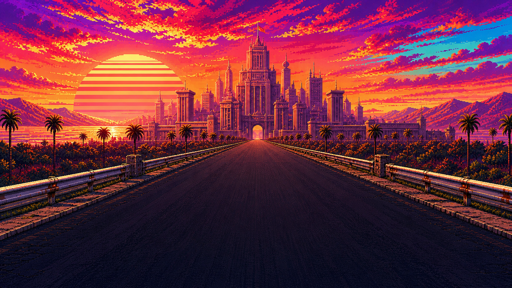</td>
  </tr>
  <tr>
    <td colspan="3" align="center"><strong>THE ADMINISTRATIVE APPROACH</strong><br><sub>The soundtrack believes this vehicle is winning.</sub></td>
  </tr>
  <tr>
    <td width="33%" align="center">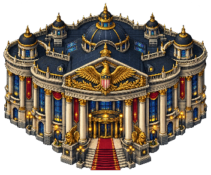</td>
    <td width="33%" align="center">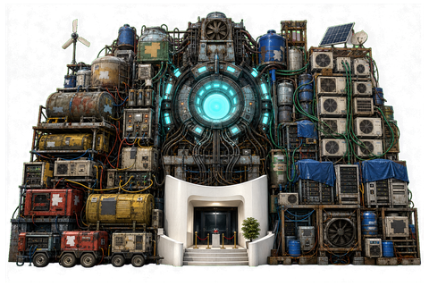</td>
    <td width="33%" align="center">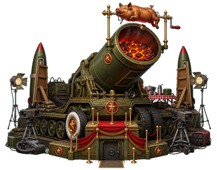</td>
  </tr>
  <tr>
    <td align="center"><strong>THE GOLDEN EAGLE</strong><br><sub>Patriotism, now with collision.</sub></td>
    <td align="center"><strong>INFERENCE REACTOR</strong><br><sub>One keynote away from grid stability.</sub></td>
    <td align="center"><strong>BROADCAST ARTILLERY</strong><br><sub>Strategic deterrence. Excellent ratings.</sub></td>
  </tr>
  <tr>
    <td width="33%" align="center">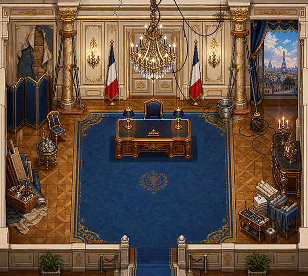</td>
    <td width="33%" align="center">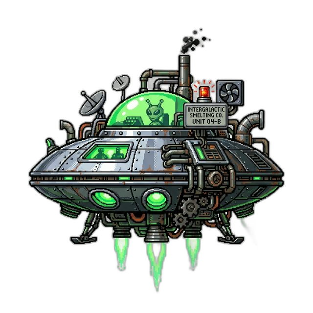</td>
    <td width="33%" align="center">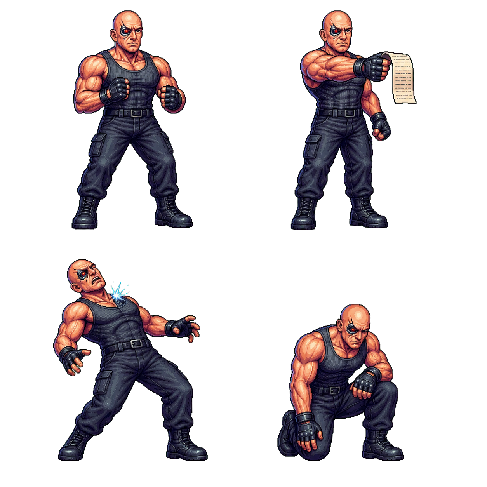</td>
  </tr>
  <tr>
    <td align="center"><strong>MANAGED DECLINE</strong><br><sub>Elegance remains within tolerance.</sub></td>
    <td align="center"><strong>UNRECONCILED MATERIAL</strong><br><sub>The evidence refuses classification.</sub></td>
    <td align="center"><strong>FULFILLMENT COMBAT</strong><br><sub>Objections processed in real time.</sub></td>
  </tr>
  <tr>
    <td width="33%" align="center">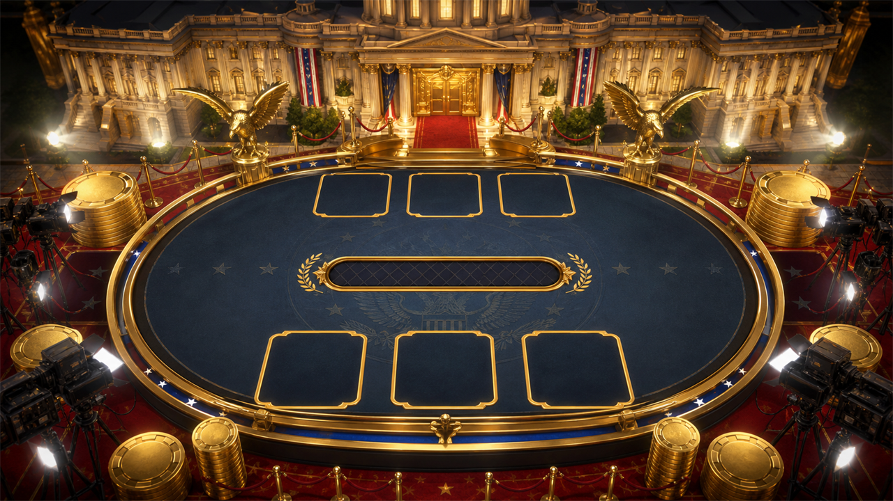</td>
    <td width="33%" align="center">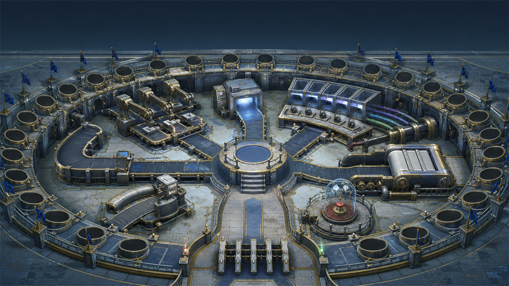</td>
    <td width="33%" align="center">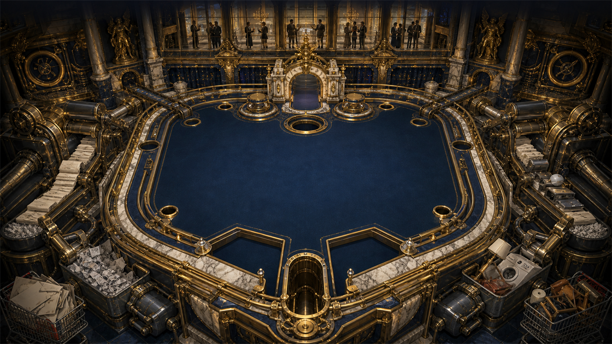</td>
  </tr>
  <tr>
    <td align="center"><strong>THE GREATEST DEAL</strong><br><sub>The arithmetic is under review.</sub></td>
    <td align="center"><strong>THE CONSENSUS ENGINE</strong><br><sub>Unanimity has entered production.</sub></td>
    <td align="center"><strong>THE 2% MIRACLE</strong><br><sub>Purchasing power not included.</sub></td>
  </tr>
</table>

The Administrative Hold and its behavioural dossier are deliberately not fully illustrated here: discovering what the system has recorded is part of the game.

## 🎨 Technical & Aesthetic Identity

- **Hybrid Civic-Surreal Style**: Pixel-scale citizens and arcade cues inhabit authored, high-detail environments whose architecture carries the political joke before dialogue begins.
- **Portrait Pipeline**: Fighter portraits use controlled chroma-key extraction, premultiplied-alpha resizing, and automated 128×128 validation for clean, halo-free transparency.
- **Authority Architecture**: The six signature encounters use dedicated 352 px hero facades with shared perspective, pixel density, lighting, and door alignment instead of procedural roof symbols. Their reusable visual contract is documented in the [facade art direction](docs/AUTHORITY_FACADE_ART_DIRECTION.md).
- **Narrative Interiors**: Authority rooms may replace the shared visual tile pass with a full authored environment while keeping the same travel, collision, dialogue, and save contract. All six signature authorities now reveal a different machine beneath their public architecture; the reusable visual grammar is documented in the [interior art direction](docs/AUTHORITY_INTERIOR_ART_DIRECTION.md).
- **Optional Investigations**: Xi, Kim, and Altman use the same authored-room contract to turn surveillance, the Red Phone, and the nuclear AI demonstration into environmental consequences rather than generic bonus rooms.
- **Southern Administrative Annex**: A dedicated optional exterior makes Kim's televised strategic spectacle and Altman's immaculate AI demo visibly depend on the same failing municipal utility layer. The [area art direction](docs/SOUTHERN_ANNEX_ART_DIRECTION.md) records its gate, layout and travel contract.
- **Classified and Anomalous Interiors**: The bunker now visualizes war as prohibited administrative routine, while the UFO gives the evidence system a room whose clocks, objects, shadows, and geometry cannot agree.
- **Bunker Access Gauntlet**: The classified route becomes a controls-first dodge encounter with telegraphed ordnance, funding traffic, instant retry, persistent access clearance, and a later dossier interpretation. Its runtime and visual contract are documented in the [gauntlet brief](docs/BUNKER_ACCESS_GAUNTLET.md).
- **Authority Access Games**: Trump, Ursula, and Lagarde gate their existing rooms with three self-contained, controls-first procedures whose outcomes become behavioural evidence. Their shared travel, persistence, and interaction contract is documented in the [authority access brief](docs/AUTHORITY_ACCESS_GAMES.md).
- **Broadcast-to-Arcade Opening**: A short skippable CRT bulletin establishes the civic world before handing off to a mandatory fixed-16:9 highway sequence with steering, sweeping perspective curves, contradictory signage, four physical bureaucratic set pieces, road damage, vehicle deterioration, engine sound, the original **Coastline Dash** soundtrack, and arrival. See the [news-broadcast brief](docs/NEWS_BROADCAST_SEQUENCE.md) and [opening-drive brief](docs/OPENING_DRIVE_SEQUENCE.md).
- **VHS/CRT Effects**: Custom shaders preserve the 80s/90s cabinet identity with scanlines, chromatic aberration, vignette, and restrained display noise.
- **Authored District Ground**: A continuous 2176×2048 pixel-art plate gives all six authority compounds a distinct material identity without visible tile seams. Path reservations, collisions, forests, encounters, and entrances remain procedural gameplay layers above it. The contract and generation prompt are documented in the [district art direction](docs/WORLD_DISTRICT_ART_DIRECTION.md).

## 🤝 Contributing

**The bureaucracy is accepting applications.** Contributions are welcome—from bug fixes and dialogue to encounters, pixel art, rooms, accessibility, translations, tests, tooling, and carefully scoped architectural improvements.

Start with [`CONTRIBUTING.md`](CONTRIBUTING.md), then use the [`architecture guide`](docs/ARCHITECTURE.md) to find the right system. The source-code license is in [`LICENSE`](LICENSE); media and narrative rights are explained separately in [`ASSET_NOTICE.md`](ASSET_NOTICE.md).

## 🚀 Play & Run Locally

1. **Prerequisites**: Godot Engine 4.6 (Standard).
2. **Setup**:
   - Clone the repository.
   - Open `project.godot` in the engine.
   - Run the `main.tscn` scene.
3. **Web Support**: Optimized for GLES3, with a custom CI/CD pipeline for GitHub Pages deployment.

Or [play the current build directly in your browser](https://daniele-cangi.github.io/civic-nightmare/).

## 🧩 Project Structure

`scripts/main.gd` is the composition root: it builds the overworld and coordinates the game-specific story transitions. Reusable state and UI behavior live in focused modules:

- `scripts/managers/`: dialogue, quest progression, behavioural evidence, versioned save data, room transitions, environment setup, and static world landmarks.
- `scripts/data/`: read-only character colors, portraits, world sprites, and authority-facade metadata.
- `assets/landmarks/`: runtime-sized exterior hero facades for the six required-signature locations.
- `assets/interiors/`: opaque authored room backgrounds aligned to the shared indoor gameplay canvas.
- `assets/backgrounds/`: collision-neutral overworld ground art rendered beneath the procedural gameplay layers.
- `assets/sequences/`: runtime artwork created specifically for authored presentation sequences.
- `assets/audio/`: approved runtime music with explicit ownership and rights notes; source masters remain outside the exported tree.
- `assets/runtime/props/`: the small promoted vendor subset actually used by interiors.
- `asset_sources/`: non-exported editable masters and retained source material; heavyweight source formats use Git LFS here only.
- `tmp/generated/`: ignored, reproducible generator output; selected runtime art must be promoted deliberately into `assets/`.
- `scripts/sequences/`: title, news broadcast, playable approach, Administrative Hold, MK, and ending presentation timelines.
- `scripts/encounters/`: self-contained Xi, Kim, UFO, Bezos, bunker, Greatest Deal, Consensus Engine, and Price Stability Pinball logic.
- `data/characters.json`: character dialogue, choices, and presentation metadata.
- `scenes/interiors/`: reusable interior scenes and room-local behavior.
- `scenes/areas/`: authored exterior travel containers that reuse the room transition contract without indoor presentation.

See [`docs/ARCHITECTURE.md`](docs/ARCHITECTURE.md) for ownership boundaries, runtime flow, and contributor guidance.

## ✅ Verification

From the repository root, run:

```bash
godot --headless --path . --editor --quit
godot --headless --path . --log-file .godot/flow-smoke.log --script res://tests/smoke_test.gd
```

The smoke test loads the main scene and covers the title flow, six-signature dossier interpretation, Dossier-to-world consequences, authority access rules, save/restore round trips, Administrative Hold, AI dialogue, and an interior round trip. Pull requests run parse, smoke, and Web export before they can reach the Pages deploy step.

Asset ownership and repository-weight decisions are recorded in [`docs/ASSET_INVENTORY.md`](docs/ASSET_INVENTORY.md); release verification lives in [`docs/RELEASE_CHECKLIST.md`](docs/RELEASE_CHECKLIST.md).

## ⚖️ License

**Source code and software implementation:** [MIT](LICENSE).

**Media and narrative content:** not automatically covered by the MIT code license; see [`ASSET_NOTICE.md`](ASSET_NOTICE.md) for the repository's rights boundary and contribution policy.

---

*"Your passport will arrive in 4-6 business years. Thank you for your patience."*
